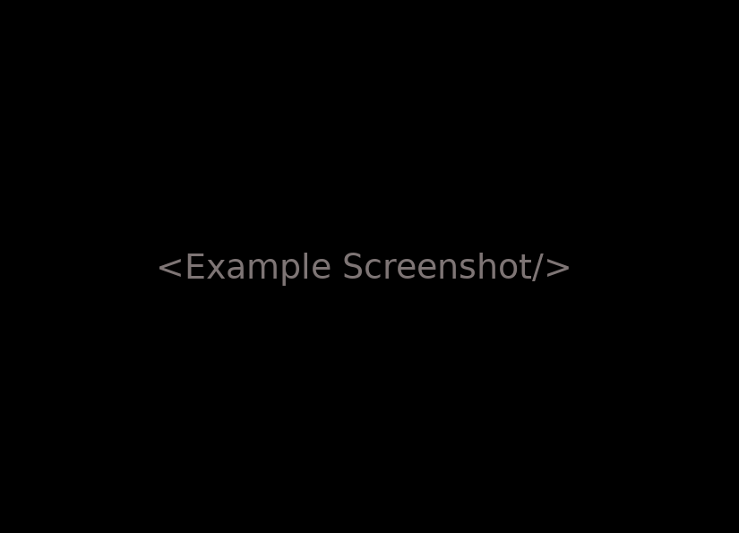

# Ready React

Just one React part built for use in your project.
This one is only to use like example.

## Dependencies

    react: ^16.4.2
    react-dom: ^16.4.2
    react-scripts: 1.1.5

## Usage

1 - Get download [here.](https://github.com/ready-react/ready-react-example/archive/master.zip)

2 - Copy the folder `/src/ready-react-example` into your project `/src/components`.

3 - Install the [dependencies](#dependencies).

## See this working

    npm install
    npm start

Open [http://localhost:3000](http://localhost:3000) to view it in the browser.